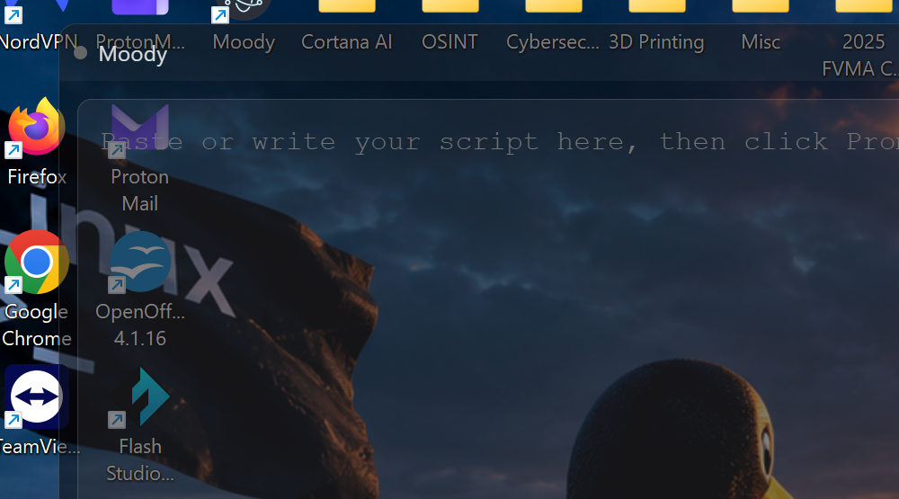

# Moody for Windows

A free, open-source Windows teleprompter overlay inspired by [Moody](https://moody.mjarosz.com/)
($39, Mac-only). Floats on top of everything, stays invisible to screen share/recording/screenshots,
and auto-scrolls your script based on your voice — so you can read naturally while recording a
video, presenting on a call, or livestreaming, without anyone seeing the prompter.



## System requirements

- Windows 10 (2004+) or Windows 11 — needed for the screen-capture-exclusion feature
- A microphone, for voice-activated scrolling (optional — you can also scroll at a fixed manual speed)
- No account, no internet connection required to run it; nothing is uploaded anywhere

## Download

**[⬇ Download the latest installer](https://github.com/cyberhunter73/moody-windows/releases/latest)**
— grab the `.exe` under Assets, double-click it, done. No admin rights needed; it installs in a
couple seconds and adds a Desktop + Start Menu shortcut.

Windows SmartScreen may warn "unknown publisher" since this isn't code-signed — click
**More info → Run anyway**.

## Getting started

1. Launch **Moody** from the Desktop or Start Menu shortcut the installer created. A small
   floating window appears — drag its top bar to position it near your camera.
2. Click **Edit**, paste or type your script, then click **Start Prompting →**.
3. The first time you play or use voice-activated scrolling, Windows will ask for microphone
   permission — click **Allow**. (If you miss it, re-enable it under
   **Settings → Privacy & security → Microphone** and allow desktop apps access.)
4. Click the ▶ play button (or press `Space`) to start. With "Voice-activated" checked, the
   script scrolls while you talk and pauses when you stop — no manual control needed. Uncheck it
   to scroll at a constant speed instead.
5. Use the ⚙ gear icon to adjust text color, size, background opacity, and voice sensitivity.
6. Share your screen or start recording as normal — the Moody window will not appear to your
   viewers or in the recording, only to you.

See **Shortcuts** below for moving the window out of the way, hiding it, or quitting.

## Uninstall

Use **Settings → Apps → Installed apps**, search for "Moody for Windows", and click Uninstall —
or run `Uninstall Moody for Windows.exe` directly from its install folder
(`%LOCALAPPDATA%\Programs\moody-windows`). It's a per-user install, so no admin rights are needed
either way.

## Run from source instead

```
npm install
npm start
```

## Build the installer yourself

```
npm install
npm run dist
```

The installer is written to `dist/Moody for Windows Setup <version>.exe`.

## How it works

- **Floating overlay** — frameless, always-on-top, draggable window. Drag the top bar to move it,
  drag the bottom-right corner to resize.
- **Invisible to screen capture** — uses Electron's `setContentProtection(true)`, which on Windows
  maps to `SetWindowDisplayAffinity(WDA_EXCLUDEFROMCAPTURE)`. The window is excluded from screen
  shares (Zoom/Meet/Teams), OBS/recording software, and the OS screenshot tools — only you see it.
- **Voice-activated scrolling** — reads your mic volume via the Web Audio API; scroll speed tracks
  how loud/fast you're talking, and it pauses automatically when you stop. Toggle it off in the
  control bar to use a constant manual speed instead.
- **Script editor** — click "Edit" to write/paste your script, "Start Prompting" to go live.
- **Customization** — font size, text color, background opacity, mirror mode (for teleprompter
  glass rigs), via the gear icon.
- **Countdown timer** — the ⏱ button gives a 3-2-1 countdown before scrolling starts.
- **Hover-to-pause** — moving your mouse over the prompter text pauses auto-scroll.

## Shortcuts

| Shortcut | Action |
|---|---|
| `Ctrl+Alt+I` | Toggle click-through (lets mouse clicks pass through to apps underneath) |
| `Ctrl+Alt+H` | Show/hide the window |
| `Ctrl+Alt+Q` | Quit |
| `Space` | Play/pause scrolling (while prompter is focused) |
| `Up` / `Down` | Adjust manual scroll speed |
| `Esc` | Pause |

## Known limitations vs. the Mac original

- No camera-notch-aware auto-positioning (Windows laptops don't have a standardized notch).
- Voice activation uses raw mic volume, not real speech detection — very loud background noise
  can trigger scrolling. Adjust "Voice sensitivity" in Settings if needed.
- Not code-signed, so Windows SmartScreen may warn on first run of a packaged `.exe`.
